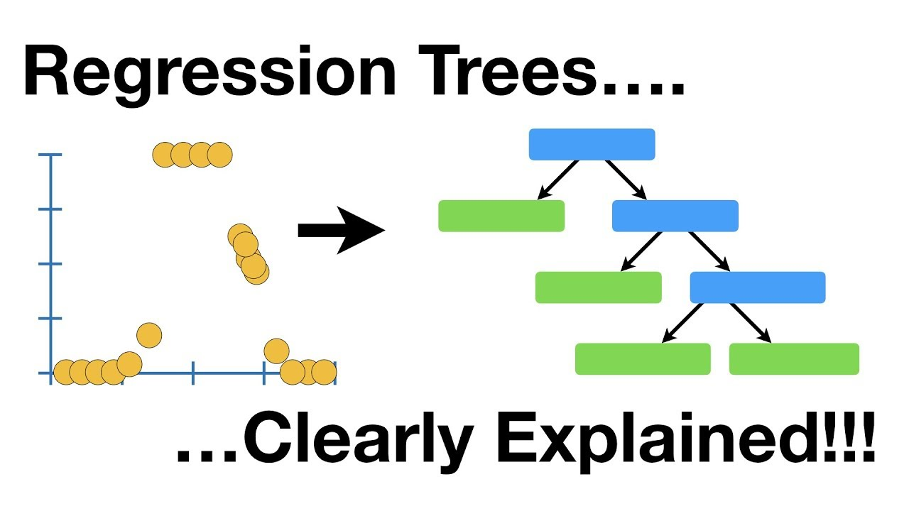

# How a tree germinates 🌳

In this section you will learn how decision trees are computed and the main criteria to split nodes. Explaining how decision trees are built with words is a boring endevour for both the writer, but mainly reader. For that reason, we will allow our friend from StatQuest to explain it to you with a visual

[Link to video](https://www.youtube.com/watch?v=_L39rN6gz7Y)

Let us now understand the main three methods on how to decide to split a node.

## Entropy

**Entropy** is a measure of the randomness or disorder within a dataset. For a classification with classes $C_1, C_2, \dots, C_n$ it is given by
 $$E(S) = - \sum_{i=1}^{n} p_i \log_2(p_i), $$
where  $p_i$ is the proportion of the elements in class $C_i$ within the set. 

Let me translate the math to reasoning for you: entropy not only measures how good you are at determining one class from another as accuracy would do, but it also measures **how certain you are** when making this decision!

[Link to video](https://www.youtube.com/watch?v=YtebGVx-Fxw)

## Information Gain
**Information Gain** is calculated as the difference in entropy before and after a dataset is split on an attribute. Essentially, it measures the change in entropy
  $$ IG(A, S) = E(S) - \sum_{v \in \text{Values}(A)} \frac{|S_v|}{|S|} E(S_v),$$
where we have the attribute $A$ for set $S$, Values $(A)$ are the different values of attribute $A$, $S_v$ is the subset of $S$ for a particular value $v$, and $\frac{|S_v|}{|S|}$ is the proportion of $v$ in $S$.

## Gini impurity
**Gini Impurity** is another measure used to gauge how often a randomly chosen element from the set would be incorrectly labeled if it was randomly labeled according to the distribution of labels in the subset. The Gini Impurity for a set $S$ is given by
$$I_G(S) = 1 - \sum_{i=1}^{n} p_i^2,$$
where $I_G(S)$ represents the Gini impurity of set $S$, and $p_i$ is the proportion of the elements in class $C_i$ within the set.

[Link to video](https://www.youtube.com/watch?v=u4IxOk2ijSs)

## In-practise: Use Gini

Although decision trees allow for both methods, the entropy criterion is computationally more expensive, since the logarithms are hard to compute. In terms of results, the difference between these metrics are negligible in most analysed cases, for that reason, we would recommend to always use Gini.

## Optional video: Regression Trees

[Link to video](https://www.youtube.com/watch?v=g9c66TUylZ4)