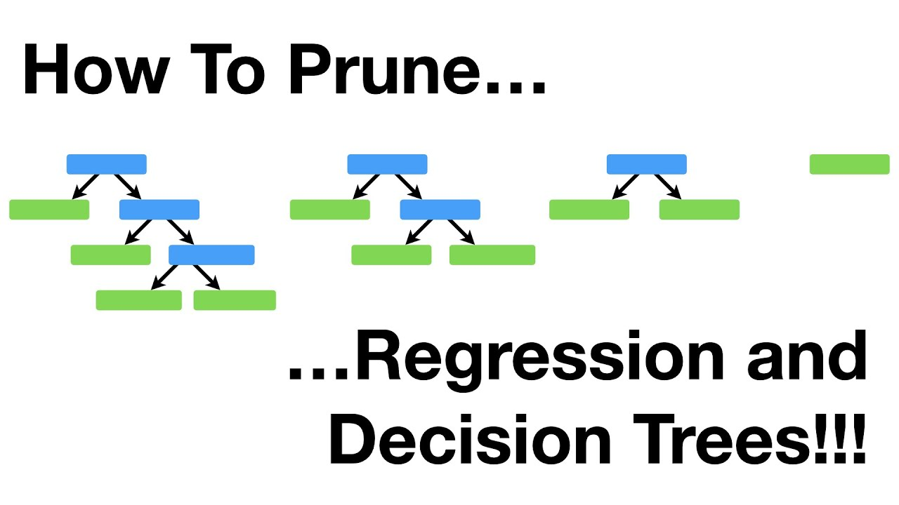

# The biology of a tree 🌳🧬🔬: hyperparameters best practices

`max_depth`: This parameter controls the maximum depth of the tree.
- **Too low**: May lead to underfitting as the tree might not capture sufficient complexity of the data.

- **Too high**: More complex relationships are modeled, increasing the risk of overfitting.

- **Best practice**: Allow the tree to grow without restraint, then utilize cross-validation to identify the optimal depth where the model's performance is balanced between the training and validation datasets.

  

`min_samples_split`: Minimum number of samples required to split an internal node.
- **Too low**: Can cause the tree to overfit by making splits for very specific cases.

- **Too high**: Might result in a tree that is too generalized, potentially underfitting the data.

- **Best practice**: Start with a small percentage of the total data and adjust based on cross-validation results, considering a balance between model complexity and overfitting.

  

`min_samples_leaf`: The minimum number of samples a leaf node must have.
- **Too low**: Trees may have leaves that only apply to a few instances, leading to overfitting.

- **Too high**: Can excessively simplify the model, causing underfitting.

- **Best practice**: Set initially to 1 for pure leaves and increase gradually. Use cross-validation to find a number where the model starts to generalize well without losing important specificity.

  

`max_features`: Number of features to consider when looking for the best split.
- **Too low**: May not capture enough information and underfit.

- **Too high**: Increases computational cost and may include noise, leading to overfitting.

- **Best practice**: Use `sqrt(number_of_features)` for classification tasks as a starting point, and adjust based on model performance and computational efficiency.

  

`splitter`: The strategy used to choose the split at each node.
- **Best**: Finds the best feature to split on, which can lead to a better model but is computationally expensive.

- **Random**: Adds stochasticity to model training, which can help with large datasets.

- **Best practice**: Default to 'best' and consider 'random' if the computation time becomes prohibitive or if the dataset is particularly large.

  

`class_weight`: Used to balance classes in the case of imbalanced datasets.
- **Balanced**: Automatically adjusts weights inversely proportional to class frequencies.

- **Custom weights**: Can be set based on domain knowledge.

- **Best practice**: Use 'balanced' for a hands-off approach or custom weights if domain knowledge suggests certain classes are more important.

  

`max_leaf_nodes`: Constrains the number of leaf nodes in the tree.
- **Too low**: Can lead to underfitting.

- **Too high**: Might make the model overly complex and prone to overfitting.

- **Best practice**: Tune this parameter using cross-validation, balancing model complexity with predictive power.

  

`ccp_alpha`: Cost-complexity pruning parameter used for tree pruning.
- **Pruning too much**: May remove important details from the model.

- **Not pruning enough**: Can leave the model too complex and prone to overfitting.

- **Best practice**: After other hyperparameters are tuned, adjust `ccp_alpha` through cross-validation to find the best value for model simplification without significant loss of performance.

[Link to video](https://www.youtube.com/watch?v=D0efHEJsfHo)
