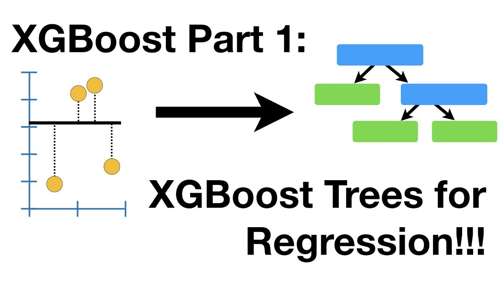

# eXtreme Gradient Boosting (XGBoost)

XGBoost (eXtreme Gradient Boosting) has gained immense popularity in machine learning due to its efficiency and performance. It stands out due to several key features that enhance its capability to handle various types of data and improve its prediction accuracy.

## High-Quality Pruning
XGBoost employs a regularized learning framework, which introduces the regularization hyperparameters `lambda` $\lambda$ and `gamma` $\gamma$ to control the complexity of the model. These hyperparameters are crucial in preventing overfitting.

- `lambda`: $\lambda$, also known as L2 regularization, penalizes the sum of the squared coefficients. This shrinkage of the leaf weights makes the prediction more robust to noise in individual trees.

- `gamma`: $\gamma$ specifies the minimum loss reduction required to make a further partition on a leaf node. It makes the algorithm conservative towards making new splits; higher values lead to fewer splits.

The interplay between $\lambda$ and $\gamma$ allows XGBoost to perform high-quality pruning during training. Nodes that contribute little to the predictive power are pruned away, resulting in a more parsimonious model.

## Faster Convergence to the Minima
Unlike traditional gradient boosting methods that use gradient descent, XGBoost employs the Newton-Raphson method for optimization. This approach utilizes both first and second-order derivatives, allowing for a more efficient convergence by considering the curvature of the loss function.

XGBoost's optimization algorithm is one of the reasons for its speed and high performance. By using a second-order approximation, XGBoost can make larger steps towards the minimum if the curvature allows for it, or smaller, more precise steps when the curvature is high.

## Efficient Handling of Sparse Data
XGBoost is designed to handle sparse data originating from various sources such as missing values or one-hot encoding. It automatically learns what is the best direction to handle missing values, depending on what is best for the reduction of the loss function.

## Built-in Cross-validation
XGBoost has an efficient cross-validation mechanism built into its algorithm, which can be used to tune hyperparameters systematically. It allows for the evaluation of model performance for each iteration, enabling early stopping if the model performance ceases to improve on a validation set.

## Extra Regularization to Combat Overfitting
XGBoost fights overfitting not just through the pruning, but also by smoothing the final learned weights, which helps in making the model less likely to capture noise in the training data. This happens via:
- `alpha`: L1 regularization, using the absolute value of the weights
- `lambda`: L2 regularization, using the squared value of the weights

## Extra Randomization Parameter
XGBoost introduces an extra randomization parameter, similar to the stochastic gradient boosting concept, which adds randomness to make training robust to noise:

- `subsample`: subsampling of the training instances and columns for each tree (akin to the random forest approach) adds variability to the model, which helps prevent overfitting and adds to the ensemble's robustness.

By combining these advanced features, XGBoost provides a potent algorithm capable of delivering high-performance models that can tackle a wide range of data science problems effectively.

 

However, as we know that visuals are of good help, we encourage you to take a look at this 4-part comprehensive explanation of our friend Josh Starmer

> Pro-tip: try listening to him at 1.5x or 2x if you feel it is too long of a series.

[Link to video](https://www.youtube.com/watch?v=OtD8wVaFm6E)

[Link to video](https://www.youtube.com/watch?v=8b1JEDvenQU)

[Link to video](https://www.youtube.com/watch?v=ZVFeW798-2I)

[Link to video](https://www.youtube.com/watch?v=oRrKeUCEbq8)

