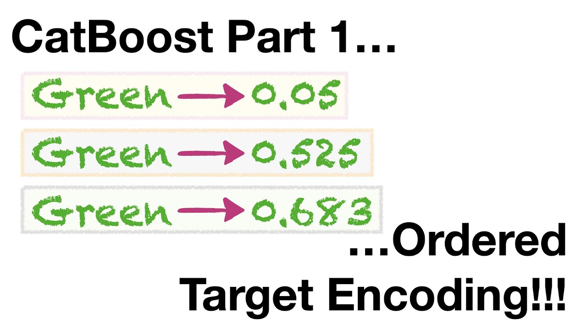
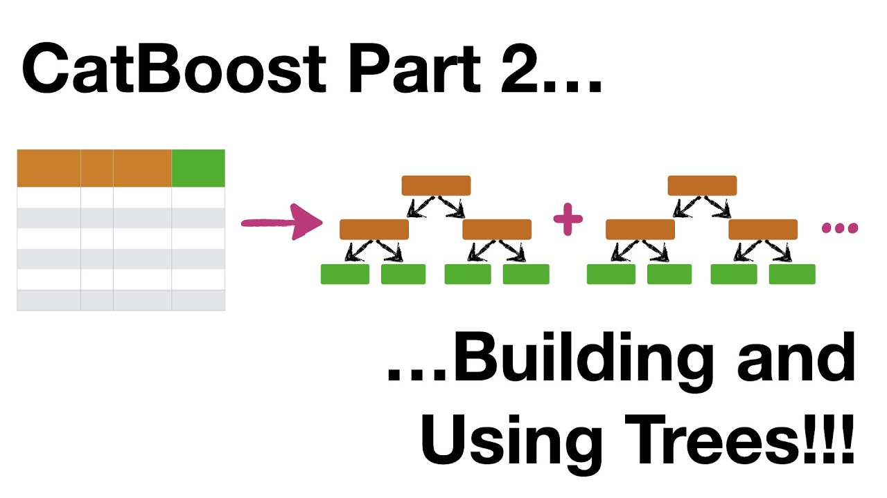

### Exploring CatBoost

`CatBoost` stands for "Categorical Boosting" and is an open-source gradient boosting library, with a particular strength in handling categorical features directly. Below are the defining features and advantages of CatBoost:

## Robust to Categorical Variables
CatBoost is specifically optimized for categorical data. Unlike other models that require extensive preprocessing like one-hot encoding, CatBoost can process categorical features internally, saving both time and memory overhead.

## Ordered Boosting
CatBoost employs an innovative boosting scheme known as "ordered boosting", which mitigates overfitting more effectively compared to traditional gradient boosting. This method uses permutations to fight bias in the learning process, leading to improved model generalization.

Here you have an explannation on how this method works:

[Link to video](https://www.youtube.com/watch?v=KXOTSkPL2X4)

## Symmetric Tree Structure
The trees built by CatBoost are symmetric, which means that the same splits are applied to the same tree level. This allows for faster model predictions and reduced overfitting, as the model complexity is controlled.

## Leaf-wise Growth with Depth Limitation
CatBoost grows trees leaf-wise rather than level-wise, but with an added depth limitation. This approach combines the benefits of leaf-wise growth and depth constraints to achieve better performance.

## Model Interpretability
CatBoost provides built-in tools for model interpretation, such as SHAP values, which help to understand the impact of the features on the model's predictions. We will learn more about this later on, these values are an amazing tool for interpretability!

## Handling Missing Data
CatBoost has an effective mechanism for dealing with missing data. It doesn't require imputation and can handle gaps in the data during training and prediction, which simplifies the data preprocessing pipeline. 

CatBoost treats missing values as a separate category that carries special meaning. It then uses oblivious decision trees, which are a form of decision tree where all nodes at the same level test the same condition, to efficiently handle these special categories. The model might, for example, decide that a missing value in a certain feature indicates a high likelihood of a particular outcome, and it will use that insight when making predictions.

[Link to video](https://www.youtube.com/watch?v=3Bg2XRFOTzg)