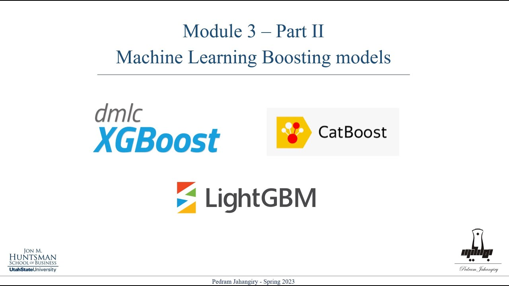

# Summary

After all these sections, you might still feel that maybe it is hard to determine the differences between the XGBoost, lightGBM and catboost. For that reason, we have a short [notebook](Learning%20Notebook.ipynb) that contains summaries and examples on basic concepts and how to implement these models. 

We also provide a nice video summary that explains the difference between these models in a clear way.

## XGBoost vs LightGBM vs CatBoost

`XGBoost`:
- **Strengths**: Robust handling of a variety of data types, renowned for its performance and accuracy in machine learning competitions.
- **Optimization**: Utilizes the Newton-Raphson method for faster convergence and has extensive regularization features to combat overfitting.
- **Flexibility**: Offers a comprehensive range of hyperparameters to fine-tune models for optimal performance.

`LightGBM`:
- **Strengths**: Designed for distributed and efficient training, particularly effective for large datasets and high-dimensional data.
- **Optimization**: Employs a histogram-based algorithm that can handle large datasets with a lower memory footprint.
- **Speed**: Utilizes Gradient-based One-Side Sampling (GOSS) and Exclusive Feature Bundling (EFB) which significantly accelerates training without compromising accuracy.

`CatBoost`:
- **Strengths**: Provides excellent handling of categorical features without the need for extensive preprocessing like one-hot encoding.
- **Accuracy**: Implements ordered boosting, a permutation-driven alternative to the classic gradient boosting method, reducing overfitting and improving model robustness.
- **User-Friendly**: Comes with a less steep learning curve and is designed to provide great results with default parameter settings.

 

[Link to video (starts at 10:12)](https://www.youtube.com/watch?v=o7cUF25hAbo&t=612s)