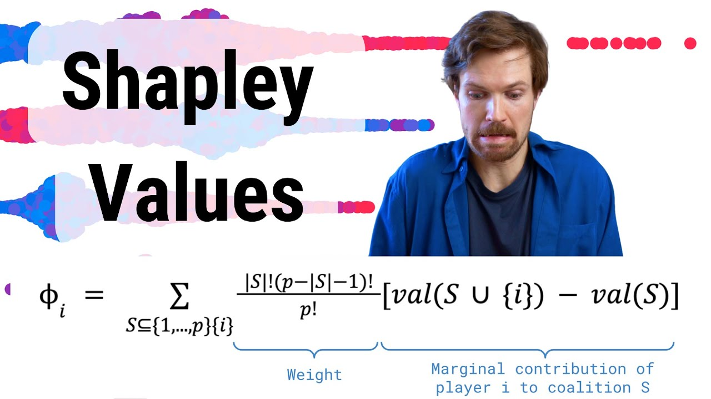
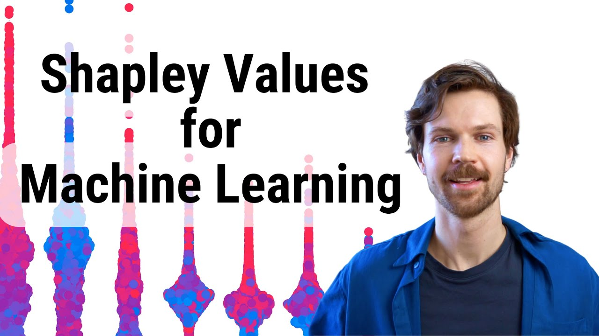
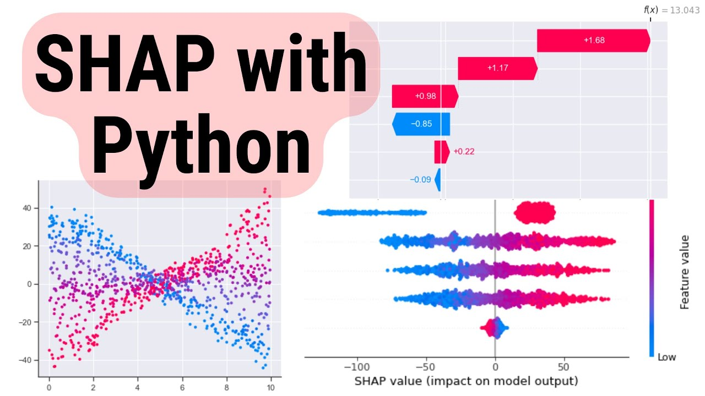
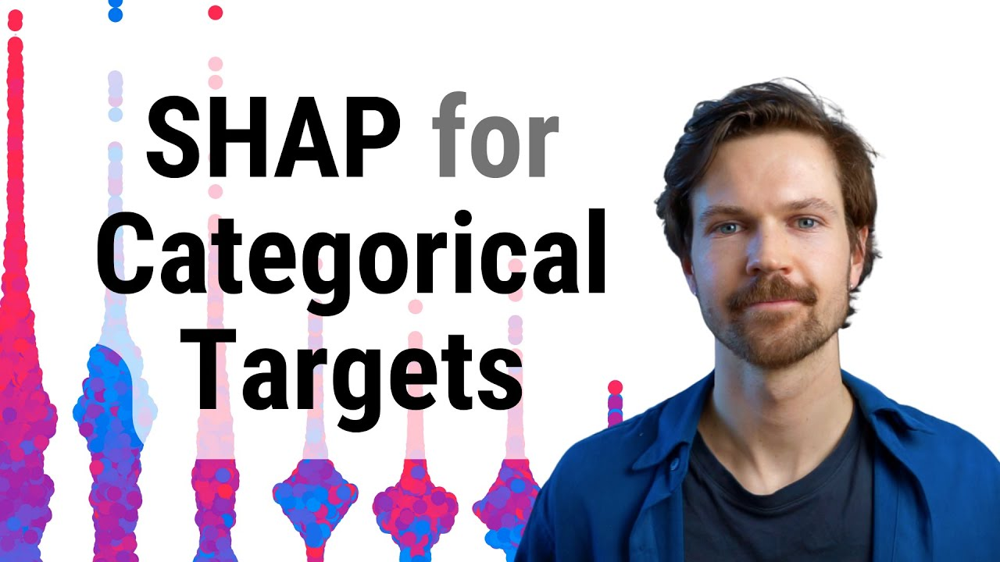

# SHapley Additive exPlanations (SHAP) 🧮

SHAP is a game-theoretic approach to explain the output of any machine learning model. They provide a robust framework for interpretability, ensuring transparency and trust in machine learning decisions.

Understanding how and why a machine learning model makes a decision is crucial for trust and accountability. SHAP offers a cohesive method for explaining individual predictions based on the contribution of each feature. 

[Link to video](https://www.youtube.com/watch?v=MQ6fFDwjuco)

It's grounded in the Shapley value—a method from cooperative game theory that assigns a fair distribution of payouts to players, or in this case, features in a model.

In machine learning, SHAP values decipher complex model predictions, providing insights into feature importance and the decision-making process. This explanation is critical across various sectors, particularly in fields like finance and healthcare, where model decisions have substantial impacts.

## Mathematical Basis of SHAP 🧮

At its core, SHAP utilizes the Shapley value from game theory. The Shapley value is a solution concept that fairly distributes both gains and costs to participants in a coalition. In the context of machine learning, the "game" involves all the input features of a model that collaborate to produce a prediction. The "payout" is the prediction itself.

The Shapley value is calculated as follows:

$$ \phi_i(v) = \sum_{S \subseteq N \setminus \{i\}} \frac{|S|!(|N|-|S|-1)!}{|N|!} (v(S \cup \{i\}) - v(S))$$

Where:
- $ N $ is the set of all players (features)
- $ S $ is a subset of players
- $ v $ is the characteristic function that assigns a value to each coalition
- $ \phi_i(v) $ is the Shapley value for player $ i $

In practice, this equates to averaging the marginal contribution of a feature across all possible combinations.

[Link to video](https://www.youtube.com/watch?v=UJeu29wq7d0)

[Link to video](https://www.youtube.com/watch?v=b9qqbFudVhI)

## Python Implementation of SHAP 🐍

SHAP can be implemented in Python using the `shap` library, which provides tools to calculate and visualize SHAP values for various models. 

[Link to video](https://www.youtube.com/watch?v=L8_sVRhBDLU)

[Link to video](https://www.youtube.com/watch?v=2xlgOu22YgE)
