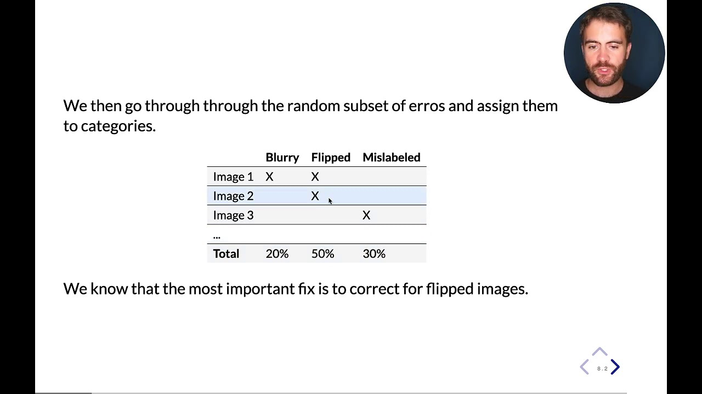

# Error Analysis 🕵️‍♂️

Error analysis is a critical step in the machine learning workflow, aimed at understanding and interpreting the types of errors a model is making, why and if it compensates fixing it. It is essential for diagnosing problems and identifying areas where the model can be improved. Through meticulous analysis of the mistakes, one can derive actionable insights to refine the model iteratively.

## Understanding Model Errors 📊

In order to understand the model errors, the strategy to follow is to select 50-100 missclassified / largely off errors in your dataset and categorise these errors into categories. Then, one needs to determine if the value of solving these errors compensates the work spent on fixing them. If only 5/100 errors suffer from the same characteristics, then fixing this would translate into infinitesimal improvement in the model. If maybe 50% of these errors are associated to the same type of mistake, then spending time on it sounds like an intelligent strategy. In here we give you two examples on how this might look like.

[Link to video](https://www.youtube.com/watch?v=kPtotLrFCVw)

[Link to video](https://www.youtube.com/watch?v=ijn7CtO0MJk)
