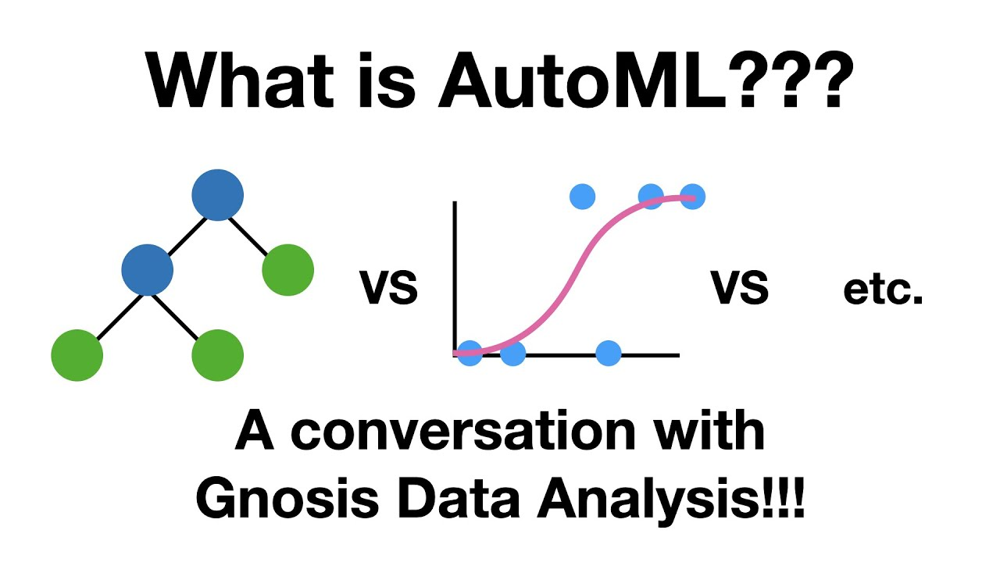

# Automatic Machine Learning (AutoML) 🤖-->🤖

AutoML, or Automated Machine Learning, simplifies the process of applying machine learning. It automates the end-to-end process of applying machine learning to real-world problems, from data preprocessing to model deployment, making it a vital tool for rapid prototyping and model enhancement.

It even performs better than most human experts and definitely in less time than a human could code.  

The only downside is that it needs human intervation in what data preparation refers to.

AutoML platforms are designed to abstract the complexity involved in manually designing machine learning models. They are particularly useful in:

- **Efficiency**: Reducing the time it takes to develop and deploy models.
- **Accessibility**: Making machine learning more accessible to non-experts.
- **Optimization**: Fine-tuning models and hyperparameters without extensive manual intervention.

## Best Practices with AutoML 📝

While AutoML can significantly streamline the model development process, it's essential to use it effectively:

- **Understand Your Data**: AutoML is not a substitute for domain knowledge. Understanding the dataset ensures that the AutoML's choices align with the problem context.
- **Set Clear Objectives**: Define what success looks like for your problem, which helps AutoML to optimize for the right metrics.
- **Iterative Approach**: Use AutoML iteratively, starting with a baseline model and progressively refining the scope based on initial results.
- **Post-Analysis**: Even after AutoML has provided a model, it's crucial to interpret the model's decisions and validate its predictions in a real-world context.

AutoML has the potential to significantly speed up the model development cycle, allowing teams to focus on problem-solving and strategic tasks. By leveraging AutoML, businesses can democratize the use of machine learning and drive innovation.

## What is left for the Data Scientist then?

This tool is amazing since it reduces the time spent on model exploration and optimization, so now Data Scientist can focus more on:
- **Domain knowledge**: it is crucial to understand 
- **Statistical Analysis**: knowing statistics about model performance, determining the roots of the model errors
- **Business intelligence**: analysing results via SHAP or other methods, giving valuable insights for business strategies
- **Designing new models**: faster better models imply... more models! More models, more insights, better business!
- **Design better model monitorization workflows**: focus on creating workflows such that the models retrain themselves if necessary or propose a new project
- **Don't tell your boss I said this... but spend some time knowing your business value**: spend sometime analysing how these tools allow you to produce *statiscally rigurous and meaningful* models that translate in tangible revenue... and ask for a raise!

## Implementation

In here we give you two videos, one interview in which the role of the Data Scientist and the importance of rigurous statistical concepts is discussed in the context of autoML and an easy tutorial on how to use one of these autoML libraries: auto-sklearn

[Link to video](https://www.youtube.com/watch?v=SEwxvjfxxmE)

[Link to video](https://www.youtube.com/watch?v=iR0Ou-8Xaqg)