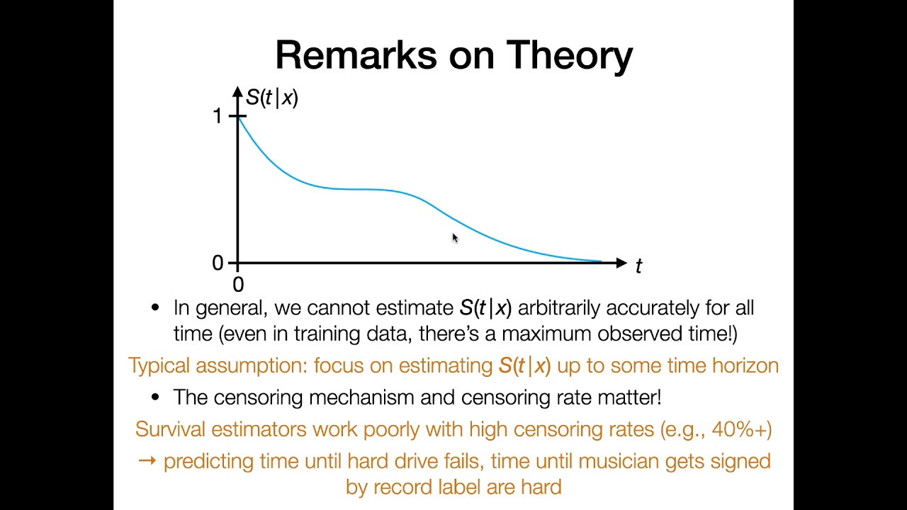
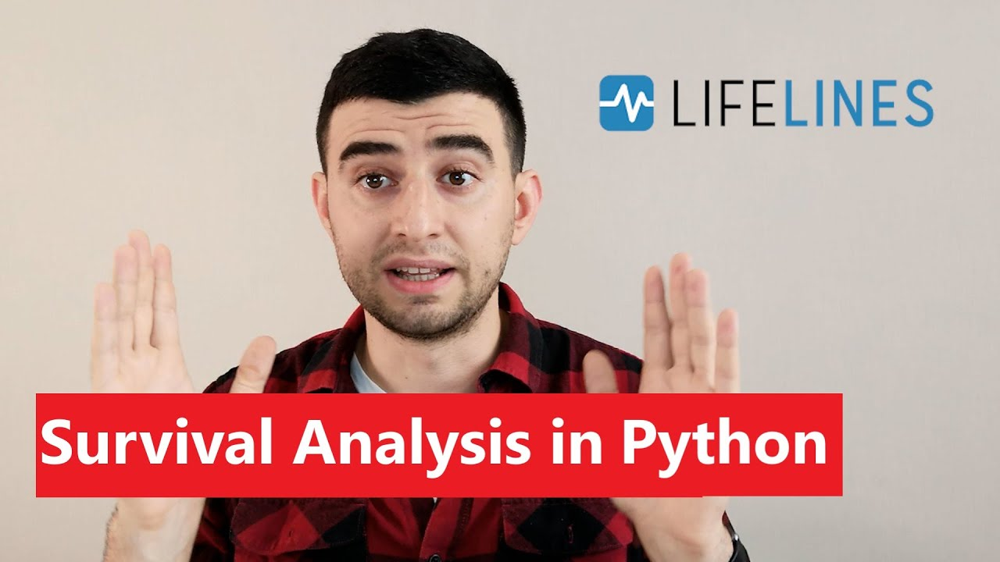

# Survival Analysis 📘
Survival Analysis is a statistical approach used to determine the expected duration of time until one or more events happen, like death in biological organisms, failure in mechanical systems or customer churn in a company. This technique is not just about predicting 'survival' in the literal sense, but broadly applies to the time until an event of interest occurs.

The key challenge in survival analysis is dealing with censored data, where the event of interest has only been partially observed. 

## Censoring 🚧
In survival analysis, _censoring_ refers to incomplete information about the survival time of individuals. In survival analysis, it refers to not knowing the exact time an event occurred, only that it occurred before or after a certain time. 

- **Right Censoring**: The most common type where we know the event has not happened until a certain point, but not when it actually happens.
- **Left Censoring**: When the event has already occurred before a certain point, but the exact time is unknown.

Censoring can introduce bias into the analysis, making it crucial to handle it appropriately to avoid skewing the results. We will explore methods to handle censored data, including likelihood functions and Kaplan-Meier estimates.


- **Likelihood Functions**: These are a set of mathematical functions that enable statisticians to estimate the parameters of survival models in the presence of censored data. The likelihood function gives the probability of observing the data we have, including the censored observations. Mathematically, for a set of n individuals with observed survival times $t_i$ and censoring indicators $\delta_i$ (where $\delta_i = 1$ if the event is observed and $\delta_i = 0$ if the data is censored), the likelihood $L$ is given by:

  $$L(\theta) = \prod_{i: \delta_i=1} f(t_i; \theta) \prod_{i: \delta_i=0} S(t_i; \theta)$$

  where $f(t_i; \theta)$ is the probability density function, $S(t_i; \theta)$ is the survival function, and $\theta$ represents the parameters of the model.

- **Kaplan-Meier Estimates**: This is a non-parametric statistic used to estimate the survival function from life data. It is particularly useful when dealing with censored data. The Kaplan-Meier estimator, also known as the product-limit estimator, calculates the probability of survival over time despite the censoring of some individuals. We will see more about this on the next sections.


## Life Tables 📊
Life tables are a tabular display of survival data. They summarize the probabilities of survival and death at various intervals for a given cohort. The table typically includes the survival function and hazard function, which are fundamental to understanding the nature of the survival data. Life tables are typically conformed by following set of columns:
- time interval
- number at risk
- number of events
- probability of surviving the interval
- survival probability

This tool is fundamental for actuaries, demographers, and anyone interested in understanding the survival patterns of a group.

## Kaplan-Meier Curves 📉
The Kaplan-Meier curve is a step function that estimates the survival function from lifetime data. It's particularly useful when you want to visualize the probability of surviving over time, taking into account right-censored data.

- **Mathematical Definition**: Given $n$ individuals, a Kaplan-Meier estimator $\hat{S}(t)$ for survival probability at time $t$ is calculated as:
  
  $$\hat{S}(t) = \prod_{i: t_i < t} \left(1 - \frac{d_i}{n_i}\right)$$

  Here, $t_i$ are the observed time points, $d_i$ are the number of events at $t_i$, and $n_i$ are the individuals at risk just before $t_i$.

- **Intuition**: The curve drops each time an event occurs and remains constant between events, reflecting the latest estimated survival probability.

- **Python Implementation**: Using the `lifelines` library, you can fit a Kaplan-Meier estimator using `KaplanMeierFitter` and plot the survival curve. You can check an example code [here](https://github.com/CamDavidsonPilon/lifelines/blob/master/docs/Survival%20analysis%20with%20lifelines.rst).

## The Hazard Function ⚠️
The hazard function, often denoted as $\lambda(t)$, describes the instant rate of occurrence of the event of interest at time $t$, conditional on survival until that time.

- **Mathematical Definition**: The hazard function is given by the formula:
  
  $$\lambda(t) = \lim_{\Delta t \to 0} \frac{P(t \leq T < t + \Delta t \,\,|\,\, T \geq t)}{\Delta t}$$
  
  where $T$ is the random variable representing the event time.

- **Intuition**: It can be thought of as the risk of the event occurring at a very small interval around time $t$, given survival up to time $t$.

- **Python Implementation**: In Python, you can estimate the hazard function using the `lifelines` library's estimators for hazard, such as the Nelson-Aalen estimator
  
  $$H(t) =  \int_0^t \lambda(z) \;dz,\qquad \hat{H}(t) = \sum_{t_i \le t} \frac{d_i}{n_i}$$

  that you can find as `NelsonAalenFitter`. There are a bunch of other methods that you can also explore, depending on the details of the survival distribution: `WeibullFitter, ExponentialFitter, LogNormalFitter, LogLogisticFitter, PiecewiseExponentialFitter, GeneralizedGammaFitter, SplineFitter`.


## Cox Proportional Hazards Model 📊
Up until now, we have made statistical models solely based on the survival times and other calculations related to it, but we have not consideres any other type of external variable.  The Cox proportional hazards model is a semiparametric model that relates the time-to-event data to one or more predictor variables. This is, it is a model that includes other information appart from the intrinsic survival rate. It is a basic model since it works as a simple linear combination of the variables and put into an exponential.

- **Mathematical Definition**: The model assumes the hazard for individual $i$ at time $t$, $\lambda_i(t)$, is:
  
  $$\lambda_i(t) = \lambda_0(t) \exp(\beta_1 x_{i1} + \beta_2 x_{i2} + \dots + \beta_p x_{ip})$$
  
  where $\lambda_0(t)$ is the baseline hazard, $\beta_j$ are the coefficients, and $x_{ij}$ are the covariates for individual $i$.

- **Intuition**: The model's strength lies in its ability to estimate the effect of several covariates on the hazard, or risk, of the event occurring, while assuming that these effects are constant over time.

- **Python Implementation**: The Cox model can be fitted using the `CoxPHFitter` class in `lifelines`. It involves creating an instance of `CoxPHFitter`, fitting it to the dataset, and then you can use it to make predictions or analyze the influence of covariates.
```python
from lifelines import CoxPHFitter

# Assuming 'df' is a pandas DataFrame containing the survival times, censoring status,
# and covariates
cox_model = CoxPHFitter()
cox_model.fit(df, duration_col='time', event_col='event')
cox_model.print_summary()
```

Check [`lifeline` documentation](https://lifelines.readthedocs.io/en/latest/Survival%20Regression.html#) on survival regression to understand the alternatives it offers for semi-parametric models.


## Summarize

In order to get a broader context of the field we recommend the following presentation. It is long, but it is worth:




[Link to video](https://www.youtube.com/watch?v=G5Q-JuVzFE0)


For a more segmented analysis, we give you a playlist in which each of these topics is addressed separatedly


[Link to playlist](https://www.youtube.com/watch?v=v1QqpG0rR1k&list=PLTNMv857s9WUclZLm6OFUW3QcXgRa97jx)


To discuss Python implementations, we give you a couple of examples. 


[Link to playlist](https://www.youtube.com/watch?v=XQfxndJH4UA)




[Link to playlist](https://www.youtube.com/watch?v=Vcph8wUsFzg)